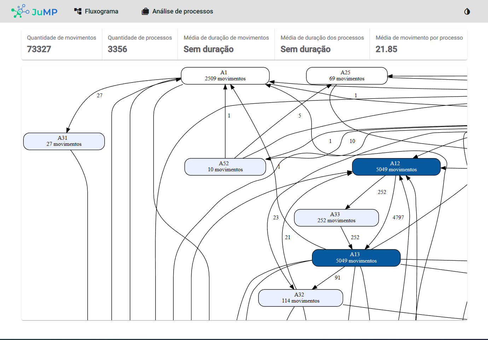

# Desafio-JuMP
[Clique aqui para redirecioná-lo para o site.](https://jdsc2-jump-frontend.netlify.app/)

## Motivação
Este projeto é parte de um modelo de avaliação e recrutamento de desenvolvimento frontend para a equipe JuMP na V-lab, no qual, fui desafiado a desenvolver uma aplicação Angular que se encontrava com diversos problemas de arquitetura e erros.

## Tecnologias
- Angular
- Docker
- FastAPI
- PM4PY
- Nginx
- D3js

## Arquitetura
O projeto foi dividido em duas partes, o frontend e o backend. O frontend foi desenvolvido em Angular e o backend em FastAPI.

## Como rodar

Para rodar o projeto, é necessário ter o docker e o docker-compose instalados na máquina. Após isso, basta rodar o comando `docker-compose up` na raiz do projeto.
Você também pode rodar o projeto sem o docker, para isso, basta seguir os passos que se encontram nas suas respectivas pastas.

## TODO

- [x] Melhorar o tooltip (cor e clicar no node).
- [x] Verificar e adicionar testes unitários
- [x] Melhorar responsividade.
- [x] Mudar UI (header fixo e transparente).
- [x] Verificar e adicionar testes e2e
